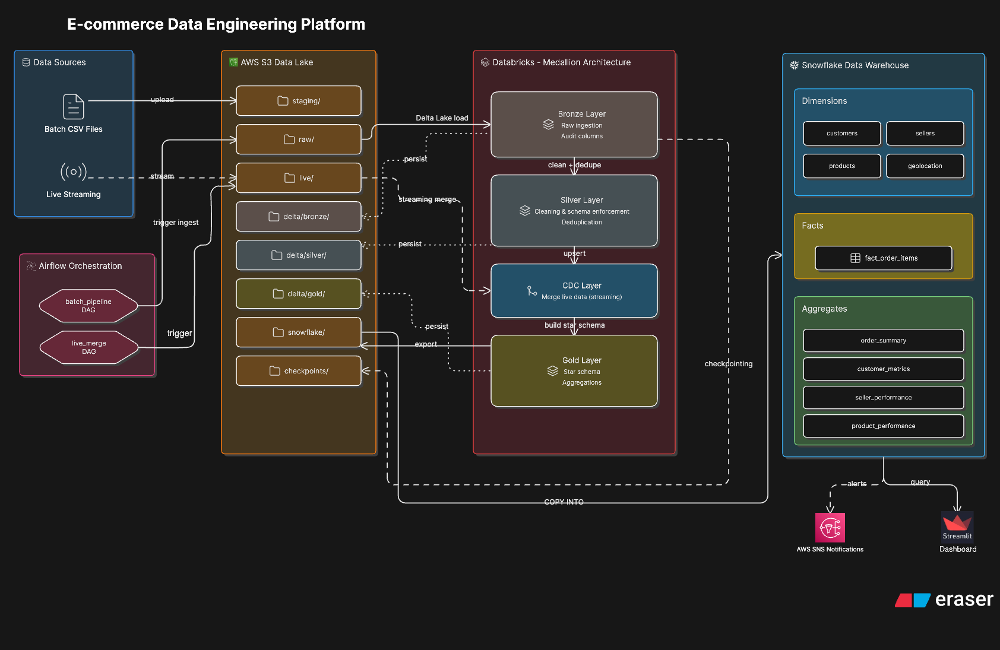

# E-Commerce Data Lakehouse
### End-to-End Batch & Streaming Analytics Pipeline

> **Capstone Project — Team 8**
> A production-grade data engineering platform built on AWS S3, Apache Spark, Delta Lake, Databricks, Apache Airflow, Snowflake, and Streamlit — processing 1.2M+ records across a multi-layer medallion architecture with real-time CDC, automated orchestration, and live BI dashboards.

---

## Table of Contents

1. [Project Overview](#1-project-overview)
2. [Architecture](#2-architecture)
3. [Technology Stack](#3-technology-stack)
4. [Repository Structure](#4-repository-structure)
5. [Data Model](#5-data-model)
6. [Pipeline Layers](#6-pipeline-layers)
   - [Bronze Layer](#61-bronze-layer)
   - [Silver Layer](#62-silver-layer)
   - [Gold Layer](#63-gold-layer)
   - [CDC Engine](#64-cdc-engine)
7. [Orchestration](#7-orchestration)
8. [Data Quality](#8-data-quality)
9. [Snowflake Integration](#9-snowflake-integration)
10. [BI Dashboard](#10-bi-dashboard)
11. [Configuration Reference](#11-configuration-reference)
12. [Setup & Deployment](#12-setup--deployment)
13. [Running the Pipeline](#13-running-the-pipeline)
14. [Checkpoint System](#14-checkpoint-system)
15. [Known Issues & Fixes Applied](#15-known-issues--fixes-applied)
16. [Performance Metrics](#16-performance-metrics)
17. [Team](#17-team)

---

## 1. Project Overview

This project implements a **full medallion data lakehouse** for an e-commerce platform (based on the Brazilian Olist dataset). It ingests raw transactional CSV data from S3, processes it through Bronze → Silver → Gold layers using PySpark on Databricks, enforces data quality checks, loads a star-schema warehouse in Snowflake, and serves live analytics through a Streamlit-in-Snowflake dashboard.

### Key Capabilities

| Capability | Details |
|---|---|
| **Batch ingestion** | 4 historical batches, full + incremental loads |
| **Live / CDC** | Real-time append + MERGE into Silver using change data capture |
| **Schema enforcement** | Config-driven casting, cleaning, and deduplication at every layer |
| **Checkpointing** | Idempotent reruns — completed batches are never reprocessed |
| **Data quality** | Automated DQ checks between Silver and Gold |
| **Orchestration** | Apache Airflow DAG on EC2 with Databricks operator |
| **Serving layer** | Snowflake star schema, 9 tables, loaded via Parquet stage |
| **Dashboarding** | Streamlit in Snowflake — 5 analytics tabs, live filters |

---

## 2. Architecture



> **Pipeline flow:** Batch CSV files and live stream data land in AWS S3 → Airflow orchestrates ingestion through Databricks Medallion layers (Bronze → Silver → CDC → Gold) → Gold Parquet exports load into Snowflake star schema → Streamlit dashboard queries Snowflake live with 10-minute cache TTL. AWS SNS fires completion alerts at end of every batch run.

<details>
<summary>📄 Text version (click to expand)</summary>

```
DATA SOURCES → AWS S3 → DATABRICKS (Bronze → Silver → Gold) → SNOWFLAKE → STREAMLIT
                                  ↑
                          AIRFLOW ORCHESTRATION
                         (batch_pipeline + live_merge DAGs)

S3 Bucket: capstone-ecomm-team8/
  ├── staging/batch_N/   ← Airflow moves files from here
  ├── raw/batch_N/       ← Bronze reads CSV from here
  ├── live/              ← Live stream files (CDC)
  ├── delta/bronze/      ← Raw ingested Delta tables
  ├── delta/silver/      ← Cleaned, merged Delta tables
  ├── delta/gold/        ← Star schema Delta tables
  ├── snowflake/         ← Parquet exports (COPY INTO)
  └── checkpoints/       ← Idempotent run state (JSON)

Databricks Medallion:
  Bronze  → Raw ingest, type casting, audit columns
  Silver  → Clean, deduplicate, enrich, Delta MERGE
  CDC     → Live stream upsert into Silver
  Gold    → Star schema: 4 dims + 1 fact + 4 aggregates

Snowflake Star Schema:
  dim_customers, dim_sellers, dim_products, dim_geolocation
  fact_order_items (118K rows)
  order_summary, customer_metrics, seller_performance, product_performance

Airflow DAG (batch_pipeline):
  move_files → sense_files → Bronze → Silver → DQ → Gold
  → [4 dims parallel] → fact → [4 aggs parallel] → SNS notify
```

</details>

---

## 3. Technology Stack

| Layer | Technology | Purpose |
|---|---|---|
| Storage | AWS S3 | Raw files, Delta Lake, Parquet exports, checkpoints |
| Compute | Databricks (Serverless) | PySpark processing across all 3 medallion layers |
| Table Format | Delta Lake | ACID transactions, schema evolution, time travel |
| Orchestration | Apache Airflow 2.x on EC2 | DAG scheduling, task dependencies, retries |
| Warehouse | Snowflake | Star schema serving layer, COPY INTO from S3 stage |
| Dashboard | Streamlit in Snowflake | Live BI analytics, no external hosting needed |
| Notifications | AWS SNS | Pipeline completion alerts |
| Language | Python 3.x / PySpark | All pipeline logic |

---

## 4. Repository Structure

```
Capstone_final/
└── Databricks/
    ├── bronze_engine.py        # Layer 1: Raw CSV ingestion → Delta Bronze
    ├── silver_engine.py        # Layer 2: Cleaning, merging → Delta Silver
    ├── gold_engine.py          # Layer 3: Star schema aggregation → Delta Gold
    ├── cdc_engine.py           # Change Data Capture: live stream → Silver MERGE
    ├── utils.py                # Shared utilities: read/write/log/transform
    ├── table_config.py         # Single source of truth for all table definitions
    ├── checkpoint_manager.py   # Idempotent run tracking via S3 JSON files
    └── Notebooks/
        ├── run_bronze          # Databricks notebook: invokes BronzeEngine
        ├── run_silver          # Databricks notebook: invokes SilverEngine
        ├── run_dq              # Databricks notebook: invokes DQ checks
        └── run_gold            # Databricks notebook: invokes GoldEngine

Airflow/
├── dags/
│   └── batch_pipeline.py      # Main orchestration DAG
└── plugins/
    └── operators/
        └── databricks_operator.py   # Custom Databricks notebook runner

Snowflake/
└── snowflake_setup.sql         # DDL for all 9 tables + S3 stage

Dashboard/
└── dashboard.py                # Streamlit in Snowflake application
```

---

## 5. Data Model

### Source Tables (Olist Dataset)

| Table | Description | ~Rows |
|---|---|---|
| `orders` | Order header records with status and timestamps | 99K |
| `order_items` | Line items per order (product, seller, price) | 112K |
| `order_payments` | Payment method and installments per order | 104K |
| `order_reviews` | Customer review scores and comments | 100K |
| `customers` | Customer demographics and location | 99K |
| `sellers` | Seller profiles and location | 3K |
| `products` | Product catalog with dimensions | 33K |
| `geolocation` | ZIP code → lat/lng mapping | 1M |
| `category_translation` | Portuguese → English category names | 71 |

### Gold Star Schema

```
                    ┌─────────────────┐
                    │  dim_customers  │
                    │  customer_id PK │
                    └────────┬────────┘
                             │
┌──────────────┐    ┌────────▼──────────────┐    ┌──────────────────┐
│ dim_sellers  │    │   fact_order_items    │    │  dim_products    │
│ seller_id PK ├───▶│                       │◀───│  product_id PK   │
└──────────────┘    │  order_id             │    └──────────────────┘
                    │  order_item_id        │
┌──────────────┐    │  customer_id FK       │
│dim_geolocation│   │  seller_id FK         │
│zip_code PK   │    │  product_id FK        │
└──────────────┘    │  price                │
                    │  freight_value        │
                    │  total_amount         │
                    │  payment_value        │
                    │  delivery_days        │
                    │  delay_flag           │
                    │  on_time_flag         │
                    │  review_score         │
                    └───────────────────────┘

Aggregate Tables (pre-computed from fact):
  order_summary      — per-order rollup
  customer_metrics   — LTV, order frequency, avg review
  seller_performance — revenue, on-time rate, avg delivery
  product_performance — units sold, avg price, avg review
```

---

## 6. Pipeline Layers

### 6.1 Bronze Layer

**File:** `bronze_engine.py`

The Bronze layer is the raw ingestion layer. Its only job is to get data from S3 CSVs into Delta tables as faithfully as possible, with minimal transformation. No business logic, no DQ enforcement.

**What it does:**
- Reads CSV files from `s3://capstone-ecomm-team8/raw/batch_N/`
- Reads all columns as strings first (`inferSchema=False`) to avoid type inference errors
- Applies schema casts from `table_config.py` (timestamps, ints, doubles)
- Adds audit columns: `ingestion_timestamp`, `source_file`, `batch_id`
- Writes to Delta format at `s3://capstone-ecomm-team8/delta/bronze/{table_name}`
- Registers tables in Unity Catalog as `bronze.{table_name}`
- Uses `overwrite` for reference tables (batch 1 only), `append` for transactional batches 2–4
- Marks checkpoint on successful completion — skips if already done

**Batch modes:**

| Mode | Tables | Write Strategy |
|---|---|---|
| `batch_1` | All reference + transactional | Reference: overwrite, Transactional: overwrite with partition |
| `batch_2/3/4` | Transactional only | Append, partition by `batch_id` |
| `live` | Transactional only | Append to existing Delta, create new if missing |

**Key design decisions:**
- `multiLine=True` on CSV reader handles Portuguese review text with embedded commas and newlines
- `mode=PERMISSIVE` silently nullifies malformed rows instead of crashing
- `overwriteSchema=True` on first writes prevents Delta schema merge conflicts

---

### 6.2 Silver Layer

**File:** `silver_engine.py`

Silver is the cleaned, conformed, and deduplicated layer. Data here is trusted for analytics.

**Processing order per table (critical — do not reorder):**

```
Read Bronze → Filter by batch_id → Clean → Enforce Schema → Join enrichment → MERGE into Silver
```

**Cleaning rules** (driven entirely by `table_config.py`, no hardcoded logic):

| Action | Description |
|---|---|
| `to_timestamp` | Parses timestamp strings |
| `cast_int` / `cast_double` | Safe numeric casting |
| `trim` / `upper` / `initcap` | String normalization |
| `fill_null` | Replace nulls with defaults |
| `replace_value` | One-to-one value substitution |
| `rename` | Fix column name typos (e.g. `lenght` → `length`) |

**Schema enforcement** runs after cleaning to avoid double-casting conflicts on timestamp columns.

**Join enrichment:** Tables with a `join` key in `table_config.py` are automatically enriched. Currently used for `products` → `category_translation` to add `product_category_name_english`.

**MERGE strategy:** All transactional tables use Delta `MERGE` (upsert) by `merge_keys` defined in config. Reference tables without merge keys use full overwrite. Before every merge, schemas are aligned between the incoming DataFrame and the existing Silver table to prevent type mismatch errors.

**Deduplication:** Before merging, rows are deduplicated by `merge_keys`, keeping the latest by `ingestion_timestamp`.

---

### 6.3 Gold Layer

**File:** `gold_engine.py`

Gold contains the star schema — aggregated, analytics-ready tables written as both Delta (for Databricks queries) and Parquet (for Snowflake ingestion).

**Tables built:**

| Table | Source | Key Transformations |
|---|---|---|
| `dim_customers` | Silver customers | Pass-through |
| `dim_sellers` | Silver sellers + geolocation | Left join on ZIP prefix for lat/lng |
| `dim_products` | Silver products | Includes English category name from Silver join |
| `dim_geolocation` | Silver geolocation | Pass-through |
| `fact_order_items` | Orders + Items + Payments + Reviews | Joins, `delivery_days`, `delay_flag`, `on_time_flag` |
| `order_summary` | fact_order_items | Group by order_id |
| `customer_metrics` | fact_order_items | LTV, frequency, last order date |
| `seller_performance` | fact_order_items | Revenue, on-time rate, avg delivery |
| `product_performance` | fact_order_items | Units, avg price, avg review |

**Computed columns in `fact_order_items`:**

```python
delivery_days  = datediff(delivered_date, purchase_timestamp)
delay_flag     = 1 if delivered > estimated else 0  (NULL if not delivered)
on_time_flag   = 1 if delivered <= estimated else 0 (NULL if not delivered)
total_amount   = price + freight_value
```

---

### 6.4 CDC Engine

**File:** `cdc_engine.py`

Handles real-time change data capture for the live stream use case.

**Flow:**
1. Reads Bronze table, filters rows where `batch_id = 'live_stream'`
2. Deduplicates by `merge_keys`
3. Adds `cdc_merge_timestamp`
4. Performs Delta `MERGE` into Silver (matched → update all, not matched → insert)

---

## 7. Orchestration

**File:** `airflow/dags/batch_pipeline.py`

The Airflow DAG `batch_pipeline` runs on-demand (no schedule) and is triggered with a `batch_number` config parameter.

### DAG Task Graph

```
move_files
    │
    ▼
sense_files (polls every 30s, timeout 5min)
    │
    ▼
run_bronze (Databricks notebook)
    │
    ▼
run_silver (Databricks notebook)
    │
    ▼
run_dq (Databricks notebook)
    │
    ▼
run_gold (Databricks notebook)
    │
    ├──▶ sf_load_dim_customers ──┐
    ├──▶ sf_load_dim_sellers    ──┤
    ├──▶ sf_load_dim_products   ──┼──▶ sf_load_fact_order_items
    └──▶ sf_load_dim_geolocation┘         │
                                          ├──▶ sf_load_order_summary
                                          ├──▶ sf_load_customer_metrics
                                          ├──▶ sf_load_seller_performance
                                          └──▶ sf_load_product_performance
                                                        │
                                                        ▼
                                                  notify_complete (SNS)
```

### Triggering a Batch Run

```bash
# Via Airflow CLI
airflow dags trigger batch_pipeline --conf '{"batch_number": "2"}'

# Via Airflow UI
# Go to batch_pipeline DAG → Trigger DAG w/ config → {"batch_number": "2"}
```

### Custom Databricks Operator

`plugins/operators/databricks_operator.py` — submits notebook runs via `/api/2.1/jobs/runs/submit` to Databricks serverless compute and polls until terminal state.

**Key implementation note:** `template_fields = ("notebook_path", "base_parameters")` must be declared for Airflow to render Jinja templates in the `batch_number` parameter before submission.

---

## 8. Data Quality

DQ checks run between Silver and Gold as a separate Databricks notebook (`run_dq`). Checks include:

- Null checks on primary key columns
- Referential integrity between orders and order_items
- Review score range validation (1–5)
- Delivery date consistency (delivered ≥ purchased)
- Duplicate detection on merge keys

---

## 9. Snowflake Integration

**Setup file:** `snowflake/snowflake_setup.sql`

### Stage Configuration

```sql
CREATE STAGE gold_s3_stage
  URL = 's3://capstone-ecomm-team8/snowflake/'
  CREDENTIALS = (AWS_KEY_ID = '...' AWS_SECRET_KEY = '...');
```

### Load Pattern

Each Gold table is loaded via `COPY INTO` from the Parquet stage:

```sql
TRUNCATE TABLE dim_customers;
COPY INTO dim_customers
FROM @gold_s3_stage/dim_customers/
FILE_FORMAT = (TYPE = 'PARQUET')
MATCH_BY_COLUMN_NAME = CASE_INSENSITIVE
FORCE = TRUE
ON_ERROR = 'CONTINUE';
```

`TRUNCATE + COPY` (full refresh) is used rather than incremental merge in Snowflake, because Gold is always rebuilt in full from Delta.

### Tables

| Table | Type | Rows (approx) |
|---|---|---|
| `dim_customers` | Dimension | 99K |
| `dim_sellers` | Dimension | 3K |
| `dim_products` | Dimension | 33K |
| `dim_geolocation` | Dimension | 19K |
| `fact_order_items` | Fact | 118K |
| `order_summary` | Aggregate | 99K |
| `customer_metrics` | Aggregate | 96K |
| `seller_performance` | Aggregate | 3K |
| `product_performance` | Aggregate | 33K |

---

## 10. BI Dashboard

**File:** `dashboard/dashboard.py` — deployed as Streamlit in Snowflake

### Tabs & Charts

| Tab | Charts |
|---|---|
| **Revenue** | Revenue by State (bar), Revenue by Order Status (donut), Monthly Trend (area) |
| **Delivery** | Delivery Days Distribution (stacked bar), On-Time Rate vs Avg Days (bubble scatter), Delay × Review Score (heatmap) |
| **Customers** | LTV Distribution (histogram), Spend vs Frequency (scatter), Revenue by State (treemap), Top 10 Customers (table) |
| **Sellers** | Revenue vs Review (bubble), Top 15 Sellers (bar), On-Time Rate Distribution (histogram) |
| **Products** | Category Revenue + Review (dual-axis bar/line), Price vs Review (scatter), Units by Category (donut) |

### Sidebar Filters (apply globally across all tabs)

- Order Status
- Customer State
- Review Score Range (slider)
- Max Delivery Days (slider)

### KPI Cards (top of page)

Total Revenue · Total Orders · Unique Customers · Avg Order Value · Avg Delivery Days · On-Time Rate · Delay Rate · Avg Review Score

---

## 11. Configuration Reference

### `table_config.py`

This is the **single source of truth** for all table definitions. Adding a new table requires only one dict entry here — no other file changes needed.

```python
"orders": {
    "source_file": "orders_dataset.csv",    # filename in S3 raw/
    "schema": {                              # column type definitions
        "order_id": "string",
        "order_purchase_timestamp": "timestamp",
        ...
    },
    "cleaning_rules": [                      # applied in Silver, in order
        {"column": "order_purchase_timestamp", "action": "to_timestamp"},
        ...
    ],
    "merge_keys": ["order_id"],              # MERGE/dedup keys
    "dedup_keys": ["order_id"],
}
```

**Supported cleaning actions:**

| Action | Effect |
|---|---|
| `to_timestamp` | Parse string as timestamp |
| `cast_int` | Cast to IntegerType |
| `cast_double` | Cast to DoubleType |
| `cast_string` | Cast to StringType |
| `trim` | Strip whitespace |
| `upper` / `lower` / `initcap` | Case normalization |
| `upper_trim` / `initcap_trim` | Combined case + trim |
| `fill_null` | Replace NULL with default value |
| `replace_value` | Substitute specific value |
| `rename` | Rename column |

### S3 Path Constants

```python
S3_RAW          = "s3://capstone-ecomm-team8/raw"
S3_LIVE         = "s3://capstone-ecomm-team8/live"
S3_DELTA_BRONZE = "s3://capstone-ecomm-team8/delta/bronze"
S3_DELTA_SILVER = "s3://capstone-ecomm-team8/delta/silver"
S3_DELTA_GOLD   = "s3://capstone-ecomm-team8/delta/gold"
S3_SNOWFLAKE    = "s3://capstone-ecomm-team8/snowflake"
```

---

## 12. Setup & Deployment

### Prerequisites

- Databricks workspace with Unity Catalog enabled
- AWS account with S3 bucket `capstone-ecomm-team8`
- Snowflake account with `ECOMMERCE_DW` database
- EC2 instance running Apache Airflow 2.x
- Python 3.9+

### Databricks Setup

```bash
# 1. Upload all .py files to Databricks workspace
# Path: /Workspace/Shared/Capstone_final/Databricks/

# 2. Create notebooks at:
# /Workspace/Shared/Capstone_final/Databricks/Notebooks/run_bronze
# /Workspace/Shared/Capstone_final/Databricks/Notebooks/run_silver
# /Workspace/Shared/Capstone_final/Databricks/Notebooks/run_dq
# /Workspace/Shared/Capstone_final/Databricks/Notebooks/run_gold

# 3. Each notebook should import and run its engine, e.g. run_bronze:
# from bronze_engine import BronzeEngine
# engine = BronzeEngine(spark)
# engine.run(dbutils.widgets.get("batch_number"))

# 4. Create Unity Catalog schemas
spark.sql("CREATE SCHEMA IF NOT EXISTS bronze")
spark.sql("CREATE SCHEMA IF NOT EXISTS silver")
spark.sql("CREATE SCHEMA IF NOT EXISTS gold")
```

### Airflow Setup

```bash
# On your EC2 Airflow instance
pip install apache-airflow-providers-databricks
pip install apache-airflow-providers-amazon

# Copy DAG and operator
cp batch_pipeline.py ~/airflow/dags/
cp databricks_operator.py ~/airflow/plugins/operators/

# Configure Airflow connections (UI: Admin → Connections)
# databricks_default:
#   Conn Type: Databricks
#   Host: https://<your-workspace>.azuredatabricks.net
#   Token: <your-pat-token>

# aws_default:
#   Conn Type: Amazon Web Services
#   AWS Access Key ID: <key>
#   AWS Secret Access Key: <secret>

# snowflake_default:
#   Conn Type: Snowflake
#   Account: <account>
#   Database: ECOMMERCE_DW
#   Schema: PUBLIC
#   Warehouse: <warehouse>
#   Role: <role>
```

### Snowflake Setup

```bash
# Run snowflake_setup.sql in a Snowflake worksheet
# This creates:
# - ECOMMERCE_DW database and PUBLIC schema
# - All 9 tables with correct column types
# - S3 external stage gold_s3_stage
# - File format for Parquet ingestion
```

---

## 13. Running the Pipeline

### Batch 1 (Initial Load)

```bash
# Trigger via Airflow
airflow dags trigger batch_pipeline --conf '{"batch_number": "1"}'

# Or run engines manually in Databricks notebooks
BronzeEngine(spark).run("1")   # ~5 min
SilverEngine(spark).run("1")   # ~8 min
GoldEngine(spark).run()         # ~3 min
```

### Batches 2–4 (Incremental)

```bash
airflow dags trigger batch_pipeline --conf '{"batch_number": "2"}'
# Repeat for 3 and 4
```

### Live Stream

```bash
# Place live CSV files in s3://capstone-ecomm-team8/live/
BronzeEngine(spark).run("live")
CDCEngine(spark).run()
```

### Force Rerun a Batch (Reset Checkpoint)

```python
from checkpoint_manager import CheckpointManager
cp = CheckpointManager(spark)
cp.reset("2", "bronze")   # or "silver"
```

### Check Checkpoint Status

```python
from checkpoint_manager import CheckpointManager
CheckpointManager(spark).list_all()
```

---

## 14. Checkpoint System

The checkpoint system prevents duplicate processing when pipelines are rerun after failures.

**Storage:** `s3://capstone-ecomm-team8/checkpoints/batch_{N}/{stage}.json`

**JSON format:**
```json
{
  "batch": "1",
  "stage": "bronze",
  "status": "completed",
  "rows": 1135721,
  "completed_at": "2024-01-15T09:23:41Z"
}
```

**Behavior:**
- If checkpoint exists and `status=completed` → skip entire batch for that stage
- If any table fails → checkpoint is NOT written → full batch reruns next time
- Checkpoints are written only when zero errors occur across all tables

---

## 15. Known Issues & Fixes Applied

| Issue | Root Cause | Fix Applied |
|---|---|---|
| `DELTA_MERGE_INCOMPATIBLE_DATATYPE` on Bronze write | `apply_casts()` was called after `read_csv()` had already cast columns — double casting caused type conflicts | Removed redundant `apply_casts()` call in `_ingest_table()`; added `overwriteSchema=True` to `write_delta()` |
| `order_reviews` failing with timestamp cast error | CSV had Portuguese text in review comments with unescaped commas, shifting columns | Added `multiLine=True`, `quote='"'`, `escape='"'`, `mode=PERMISSIVE` to `read_csv()` |
| Checkpoint path 2168 chars long | Orchestrator notebook was calling `engine.run(REFERENCE_TABLES)` passing a dict instead of a batch number string | Fixed notebook to call `engine.run(batch_number)` — Silver already handles both ref and transactional internally |
| `write_parquet` AttributeError in Gold | Function was called in `gold_engine.py` but never defined in `utils.py` | Added `write_parquet()` function to `utils.py` |
| Airflow `INTERNAL_ERROR` / Jinja not rendered | Custom `DatabricksOperator` was missing `template_fields` declaration | Added `template_fields = ("notebook_path", "base_parameters")` to operator class |
| Products showing 100% "Unknown" category | Silver `run()` had join logic added but Silver checkpoint prevented reprocessing | Deleted Silver products table, reset checkpoint, forced rerun |
| `when` / `lit` not defined in Silver join | Missing imports in `silver_engine.py` | Added `when, lit` to `from pyspark.sql.functions import` |
| On-Time Rate showing 0% in dashboard | `on_time_flag` column never created in Gold fact table | Added `on_time_flag` to `build_fact_order_items()` and `on_time_delivery_rate` to `build_seller_performance()` |

---

## 16. Performance Metrics

| Stage | Tables | Rows Processed | Approx Duration |
|---|---|---|---|
| Bronze batch_1 | 9 | 1,135,721 | ~4 min |
| Silver batch_1 | 9 | 902,851 (after dedup) | ~7 min |
| Gold (all) | 9 | 118K fact rows | ~3 min |
| Full pipeline (Airflow) | End-to-end | 1.2M+ | ~18 min |

**Deduplication impact (geolocation):** 1,000,163 raw rows → 19,015 unique ZIP codes after Silver deduplication (avg 52 rows per ZIP collapsed to 1 via lat/lng averaging).

---

**Stack credits:** Olist Brazilian E-Commerce Dataset (Kaggle) · Apache Spark · Delta Lake · Databricks · Apache Airflow · AWS S3 · AWS SNS · Snowflake · Streamlit

---

*Last updated: April 2026*
